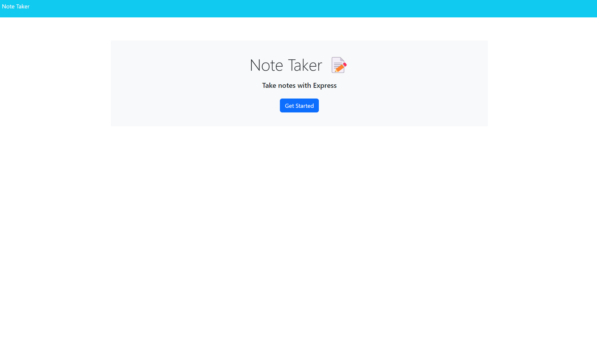
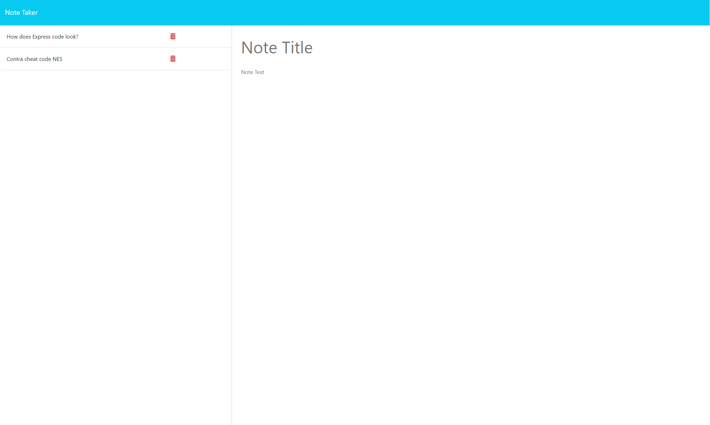

# Module 10 Challenge Note Taker 

 

 ## Description 
  My role was to bring the backend and frontend of the application together by the use of GET, POST, and DELETE request in Express.

 This application is setup to allow users to capture, organize, and manage their notes. 

 Click on the link to watch a video demonstration:
[Note Taker Video Demo](https://drive.google.com/file/d/1R_gXAcaT-CAWKogNeHB5wKXfDmKPi945/view)

 ## Table of Content
* [Installation](#installation)
* [Usage](#usage)
* [License](#license)
* [Contributing](#contributing)
* [Tests](#tests)
* [Contact](#contact)

# Installation 

Make sure that you have Node.js install, if you do not have node.js, you can visit [Node.js website](https://nodejs.org/en) and download node and install it onto your local computer. 

To install node.js onto your computer go to your terminal and type in "npm install" 

## Usage

In the terminal you would want to add the dependencies.
1. Type in "npm i express" 
2. Type in "npm i uniqid"

After adding these dependencies you are ready to run the application. In the ternimal you can type in "node.sever.js" or "npm start". A link will be provided such as localhost/3001 copy that link or hold down ctrl and click the link to open it in the brower. 

## License 

[MIT License](https://opensource.org/licenses/MIT)

## Contributing

Created for Module 11 Challege of the U of M full stack boot camp. Contact me with ideas and request for changes.

## Tests
There are no unit testing written for this application

 ## Contact

 * Email: xiongxeng@gmail.com
 * Github: http://github.com/freeway9527
